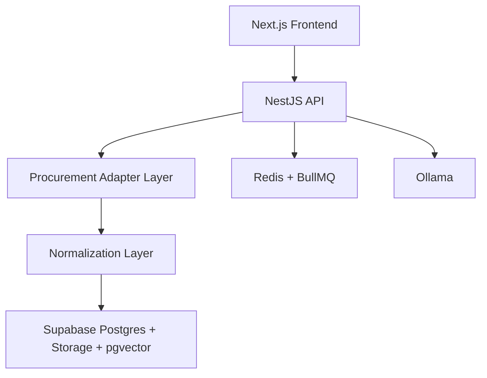

# Product Overview

Premium SaaS platform for Brazilian procurement intelligence with professional search, normalized notice detail, document ingestion, and AI-assisted interpretation.

# Architecture Diagram

# Stack Justification

- `Next.js App Router`: premium UX, URL-synced search, composable server/client boundaries.
- `NestJS`: modular backend with clean boundaries for sources, sync, documents, AI, and admin.
- `Supabase`: auth, storage, Postgres, pgvector, and operational velocity in one platform.
- `Redis + BullMQ`: ingestion, OCR, embeddings, alert dispatch, and sync orchestration.
- `Ollama`: local inference and predictable cost control.

# Folder Structure

- `apps/web`: frontend
- `apps/api`: backend
- `packages/ui`: shared UI primitives
- `packages/types`: shared contracts
- `packages/sdk`: typed client
- `packages/config`: shared Tailwind preset
- `infra/supabase/migrations`: SQL under approval workflow

# Supabase Architecture

- Existing `public.pncp_editais` is reused as the current searchable source table.
- Planned new app tables are versioned in SQL but not applied yet.
- Auth model is `auth.users` + `public.profiles`.
- Document files are intended for `Supabase Storage`.
- RAG vectors are intended for `public.notice_embeddings` using `vector`.
